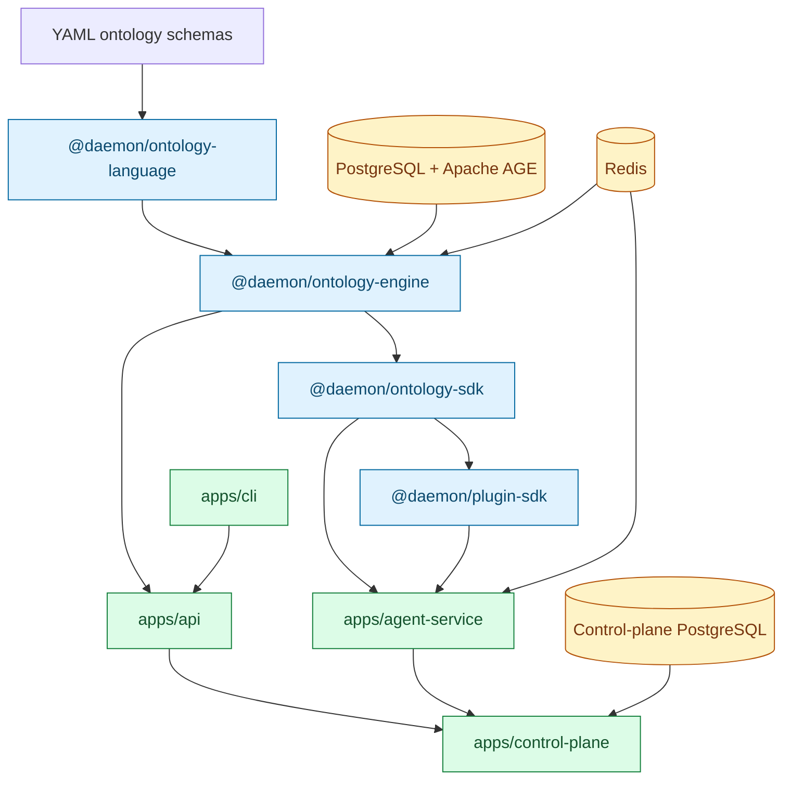

# Daemon System Ontology

Daemon System Ontology is an ontology-first enterprise operating platform for building governed, single-tenant business systems. It provides a shared semantic layer of business objects, links, actions, audit trails, and AI-assisted operations so applications and agents work from the same source of truth.

The project is inspired by Palantir Foundry-style ontology systems, but implemented as an open TypeScript monorepo with Fastify services, PostgreSQL/Apache AGE storage, Redis-backed runtime state, and a dynamic agent plugin system.

> [!NOTE]
> This repository is an active implementation. The backend, control plane, CLI, plugin SDK, and scheduled monitoring agent are implemented and covered by tests. UI applications are not included yet.

## Architecture



## What This Repo Includes

| Area | Package | Purpose |
| --- | --- | --- |
| Ontology language | `packages/ontology-language` | Parses and validates object, link, and action YAML schemas with Zod. |
| Ontology engine | `packages/ontology-engine` | Runtime registry, object persistence, action execution, audit, metrics, and schema persistence. |
| Ontology SDK | `packages/ontology-sdk` | Typed client utilities for object reads and action proposals. |
| Plugin SDK | `packages/plugin-sdk` | Runtime plugin and skill activation for agent tools. |
| API gateway | `apps/api` | Fastify HTTP API for schemas, objects, actions, audit logs, metrics, and RBAC. |
| Agent service | `apps/agent-service` | `deepagents` runtime with dynamic tools, tenant config, and scheduled monitoring. |
| Control plane | `apps/control-plane` | Tenant registry, health polling, metrics collection, logs, and WebSocket log streaming. |
| CLI | `apps/cli` | Tenant bootstrap, migration, token generation, and schema upload commands. |

## Key Capabilities

- **Ontology-first modeling** with declarative YAML schemas for object types, link types, and action types.
- **Single write path** through governed action execution and immutable audit logging.
- **Human-in-the-loop agent safety** where agents propose actions instead of executing them directly.
- **Schema hot reload** through API upload and database-backed schema persistence.
- **Object ingestion APIs** for create, update, delete, query, and bulk import flows.
- **RBAC enforcement** across API routes with viewer, operator, and admin roles.
- **Single-tenant deployment model** where each client can run an isolated API, agent service, database, and Redis instance.
- **Control-plane visibility** for tenant lifecycle, health, metrics, logs, and realtime log streaming.
- **Dynamic plugin system** for activating ontology, analytics, and monitoring tools per tenant.
- **Scheduled monitoring agent** that runs the `monitoring` skill, stores latest status in Redis, and pushes logs to the control plane.

## Technology Stack

| Layer | Technology |
| --- | --- |
| Language | TypeScript 5.4, Node.js 20+ |
| Monorepo | pnpm workspaces, Turborepo |
| HTTP services | Fastify 5 |
| Validation | Zod |
| Database | PostgreSQL with Apache AGE for graph-ready persistence |
| Data access | Drizzle ORM, `postgres` driver |
| Cache/runtime state | Redis via `ioredis` |
| Agents | `deepagents` 1.10, LangChain, LangGraph, OpenAI-compatible chat models |
| Testing | Vitest |

## Repository Structure

```text
daemon-system-ontology/
├── apps/
│   ├── agent-service/      # AI agent runtime and scheduled monitoring
│   ├── api/                # Tenant API gateway
│   ├── cli/                # Operator CLI
│   └── control-plane/      # Tenant registry, health, logs, WebSocket status
├── packages/
│   ├── ontology-engine/    # Runtime core
│   ├── ontology-language/  # YAML parser and validator
│   ├── ontology-sdk/       # Client SDK
│   └── plugin-sdk/         # Dynamic agent plugin system
├── schemas/                # Example ontology schemas
├── documentation/          # Product, architecture, and concept documentation
├── docs/superpowers/       # Implementation specs and plans
├── docker-compose.test.yml # PostgreSQL/AGE and Redis for tests
├── pnpm-workspace.yaml
└── turbo.json
```

## Getting Started

### Prerequisites

- Node.js 20+
- pnpm 9+
- Docker or Docker-compatible runtime
- PostgreSQL + Apache AGE and Redis for integration tests

On this workspace, tests are typically run from WSL with `/usr/bin/pnpm`.

### Install Dependencies

```bash
pnpm install
```

### Start Test Infrastructure

```bash
docker compose -f docker-compose.test.yml up -d
```

The test compose file exposes:

| Service | Host port | Purpose |
| --- | ---: | --- |
| PostgreSQL/Apache AGE | `5433` | Ontology and control-plane test databases |
| Redis | `6381` | Runtime state, proposals, schema cache, monitoring status |

### Run Tests

```bash
pnpm test
```

Or from WSL in this repository:

```bash
wsl -d Ubuntu -e bash -c "cd /mnt/d/script/Agentic/daemon-system-ontology && /usr/bin/pnpm test"
```

### Build All Packages

```bash
pnpm build
```

### Typecheck All Packages

```bash
pnpm lint
```

## Service Configuration

Each app has its own `.env.example`. Copy the relevant file to `.env` before running a service locally.

Important agent-service settings include:

```dotenv
AGENT_MODEL=openrouter:minimax/minimax-m2.7
OPENROUTER_API_KEY=

MONITORING_ENABLED=false
MONITORING_INTERVAL_MS=300000
CONTROL_PLANE_URL=http://localhost:4000
CONTROL_PLANE_SECRET=change-me
```

> [!IMPORTANT]
> Keep real credentials in local `.env` files only. The tracked examples use placeholders.

## Running Services Locally

Use package filters to run a specific app:

```bash
pnpm --filter @daemon/api dev
pnpm --filter @daemon/agent-service dev
pnpm --filter @daemon/control-plane dev
```

The CLI can be run through its package script:

```bash
pnpm --filter @daemon/cli dev -- --help
```

## Agent Model

The agent service uses an OpenAI-compatible model factory. Providers are selected with model strings such as:

```text
openrouter:minimax/minimax-m2.7
openai:gpt-4o
custom:your-model-id
```

Tenant-specific config can activate skills and plugins at runtime:

```json
{
  "activeSkills": ["analytics", "monitoring"],
  "activePlugins": ["ontology/core", "analytics/core"],
  "pluginConfig": {}
}
```

Wave 1 safety is explicit: agents can call `propose_action`, but action execution remains behind approval endpoints and audit logging.

## Monitoring Agent

The scheduled monitoring agent lives in `apps/agent-service` and can be enabled per deployment.

It performs a bounded monitoring pass by activating the `monitoring` skill, invoking dynamic plugin tools, persisting the latest result under `monitor:last-run:{tenantId}` in Redis, and sending structured logs to the control plane when configured.

Manual endpoints:

| Method | Path | Description |
| --- | --- | --- |
| `POST` | `/agent/monitor/run` | Trigger one monitoring cycle. |
| `GET` | `/agent/monitor/status` | Return scheduler status and latest result. |

## Documentation Map

- `documentation/README.md` - curated documentation entry point.
- `documentation/01-concepts/` - ontology-first product concepts.
- `documentation/03-architecture/` - architecture notes and governance decisions.
- `documentation/06-adrs/` - architectural decision records.
- `docs/superpowers/specs/` - implementation design specs.
- `docs/superpowers/plans/` - execution plans used to build the backend.

## Current Status

The backend foundation is implemented through the following milestones:

- Ontology parser, validator, engine, SDK, API, and agent service.
- HITL action proposals and approval/rejection lifecycle.
- Object ingestion and schema upload APIs.
- Audit trail and route-level RBAC.
- Tenant bootstrap CLI.
- Agent per-tenant configuration.
- Control-plane tenant registry, health polling, metrics, logs, and WebSocket streaming.
- Plugin SDK with ontology, analytics, and monitoring plugins.
- Scheduled client monitoring agent.

Recent full-suite verification passed with all Turborepo tasks successful.
