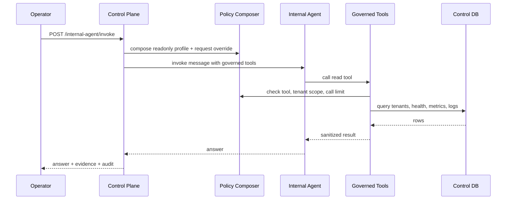

# Daemon Internal Agent Design

**Date:** 2026-05-19
**Status:** Approved for implementation
**Scope:** Plan 17 — embedded chat-style internal agent in `apps/control-plane`

## Context

Plan 12 through Plan 16 built the operational surface of the platform: tenant registry, health polling, metrics snapshots, pushed logs, WebSocket log streaming, dynamic client-side agent plugins, and a scheduled client monitoring agent. The next step is an internal control-plane agent for Daemon operators.

This agent is not a tenant/client-side worker. It is an operator-facing diagnostic assistant embedded in `apps/control-plane`. It reads control-plane metadata and observability data, answers operational questions in chat style, and returns the evidence it used.

Plan 17 remains read-only by default. However, the design must support dynamic read/write/action instructions later through explicit governance policy, not through unrestricted natural-language authority.

## Chosen Approach

Use an **Embedded Hybrid Policy Internal Agent**.

The internal agent runs inside `apps/control-plane` and exposes a chat-style endpoint:

```http
POST /internal-agent/invoke
```

The request contains an operator message and optional policy override. The control plane composes that request override with a built-in `readonly-operator` governance profile. Request overrides may only narrow access. They cannot expand the default profile into write access.

Alternative approaches were rejected for this phase:

- Separate `apps/internal-agent` service: cleaner long-term isolation, but adds unnecessary service wiring before the internal agent proves useful.
- Reusing `apps/agent-service`: wrong boundary because that service is tenant/client-side and already owns tenant ontology access.
- Direct write-capable internal agent: too risky before incident workflow, approval, and write-audit semantics exist.

## Goals

- Provide a chat-style internal agent endpoint for control-plane operators.
- Let operators ask cross-tenant diagnostic questions in natural language.
- Give the agent controlled read access to tenant, health, metrics, and log data.
- Return both a natural-language answer and structured evidence.
- Introduce a reusable governance model for future dynamic read/write/action access.
- Keep Plan 17 read-only: no suspend, activate, offboard, or mutation tools.

## Non-Goals

- No UI dashboard.
- No persistent conversation history.
- No write tools or action execution.
- No incident/alert lifecycle table.
- No multi-profile database store.
- No external data source access beyond the control-plane database.

## Endpoint Contract

### `POST /internal-agent/invoke`

Authentication uses the existing control-plane internal bearer secret. The endpoint is unavailable without `Authorization: Bearer ${INTERNAL_SECRET}`.

Request body:

```json
{
  "message": "Tenant mana yang unhealthy dalam 24 jam terakhir dan kenapa?",
  "policy": {
    "allowedTools": ["list_tenants", "get_tenant_health", "query_tenant_logs"],
    "tenantIds": ["tenant-uuid-1"],
    "maxToolCalls": 8
  }
}
```

Fields:

| Field | Required | Description |
| --- | --- | --- |
| `message` | Yes | Natural-language operator request. |
| `policy.allowedTools` | No | Optional tool allowlist. Intersected with default profile allowlist. |
| `policy.tenantIds` | No | Optional tenant scope. Intersected with default profile tenant scope. |
| `policy.maxToolCalls` | No | Optional per-request max tool calls. The lower value wins. |

Response body:

```json
{
  "answer": "Dua tenant perlu dicek: ACME API down dan Beta agent degraded.",
  "evidence": {
    "toolsCalled": ["list_tenants", "get_tenant_health", "query_tenant_logs"],
    "tenantIds": ["tenant-uuid-1", "tenant-uuid-2"],
    "timeWindowHours": 24,
    "recordsInspected": {
      "tenants": 12,
      "healthChecks": 36,
      "logs": 50,
      "metrics": 12
    }
  },
  "audit": [
    {
      "tool": "list_tenants",
      "action": "allowed"
    }
  ]
}
```

The exact `answer` text is model-generated. The `evidence` and `audit` shape are deterministic server-side output assembled from tool execution metadata.

## Governance Model

### Default Profile

Plan 17 ships one built-in profile: `readonly-operator`.

```typescript
export interface InternalAgentPolicy {
  profile: 'readonly-operator';
  allowedTools: string[];
  tenantIds?: string[];
  maxToolCalls: number;
}
```

Default values:

```typescript
const READONLY_OPERATOR_POLICY: InternalAgentPolicy = {
  profile: 'readonly-operator',
  allowedTools: [
    'list_tenants',
    'get_tenant',
    'get_tenant_health',
    'get_tenant_metrics',
    'query_tenant_logs',
    'summarize_tenant_incidents',
  ],
  maxToolCalls: 12,
};
```

`tenantIds` omitted means all non-offboarded tenants in the control-plane registry are in scope. If a request supplies `tenantIds`, the final scope is restricted to those tenant IDs.

### Policy Composition

The final policy is computed with most-restrictive-wins semantics:

| Policy field | Composition rule |
| --- | --- |
| `allowedTools` | If request supplies tools, final tools are the intersection of default tools and request tools. Unknown or write tools are removed. |
| `tenantIds` | If request supplies tenant IDs, final tenant scope is restricted to those IDs. |
| `maxToolCalls` | Final value is `Math.min(default.maxToolCalls, request.maxToolCalls ?? default.maxToolCalls)`. |

The agent never receives raw repository instances. It receives governed tools only.

### Tool Enforcement

Every tool call passes through `InternalAgentGovernance`:

1. Check tool name is in `allowedTools`.
2. Check tool call count does not exceed `maxToolCalls`.
3. Check requested tenant ID is in the final tenant scope.
4. Execute the read-only repository query.
5. Record an audit entry with allowed, denied, or error status.

If a tool call is denied, the tool returns a safe denial message to the model and records audit. The HTTP request still succeeds unless the top-level request body is invalid.

## Internal Tools

### `list_tenants`

Purpose: list active tenants and latest health summary.

Data source: `TenantRepository.findWithStatus()`.

Inputs:

```json
{}
```

Output includes tenant IDs, slug, display name, plan, status, latest API health, latest agent health, and last checked timestamp. It does not expose business object data.

### `get_tenant`

Purpose: inspect one tenant's metadata and latest metrics snapshot.

Data source: `TenantRepository.findById()` and `TenantRepository.getLatestMetrics()`.

Inputs:

```json
{ "tenantId": "tenant-uuid" }
```

### `get_tenant_health`

Purpose: inspect health history for one tenant and service.

Data source: `HealthRepository.getHealthHistory()`.

Inputs:

```json
{ "tenantId": "tenant-uuid", "service": "api", "limit": 50 }
```

`service` is restricted to `api` or `agent`.

### `get_tenant_metrics`

Purpose: inspect recent metrics snapshots for one tenant.

Data source: `HealthRepository.getMetricsHistory()`.

Inputs:

```json
{ "tenantId": "tenant-uuid", "limit": 24 }
```

### `query_tenant_logs`

Purpose: inspect recent pushed logs for one tenant.

Data source: `LogRepository.query()`.

Inputs:

```json
{
  "tenantId": "tenant-uuid",
  "service": "agent",
  "level": "error",
  "limit": 50
}
```

`service`, `level`, and `limit` are optional. `limit` is capped at 200.

### `summarize_tenant_incidents`

Purpose: deterministic read helper that combines latest health and error logs for one tenant.

Data source: `TenantRepository`, `HealthRepository`, and `LogRepository`.

Inputs:

```json
{ "tenantId": "tenant-uuid", "windowHours": 24 }
```

The helper returns a compact summary of unhealthy services, recent error log counts, and latest metrics. It remains read-only and does not create incident records.

## Model Configuration

Plan 17 should reuse the same OpenAI-compatible model approach used by `apps/agent-service` without coupling control-plane to tenant agent code.

Add local control-plane model config:

```dotenv
INTERNAL_AGENT_MODEL=openrouter:minimax/minimax-m2.7
OPENROUTER_API_KEY=
OPENROUTER_BASE_URL=https://openrouter.ai/api/v1
```

The implementation can either duplicate a minimal model factory in `apps/control-plane` or later extract a shared model package. Plan 17 should prefer local duplication to avoid a broad refactor.

## Prompt

The internal agent system prompt should be strict:

```text
You are Daemon Internal Agent, an operator assistant for the Daemon control plane.
You diagnose tenant health, metrics, and logs using only the tools provided.
You are read-only in this phase. Do not claim to suspend, activate, offboard, mutate, or remediate tenants.
When answering, cite the tools and records you used. If evidence is insufficient, say so.
Never reveal secrets, internal bearer tokens, environment variables, or raw credentials.
Return concise operational guidance with recommended follow-up steps.
```

## Data Flow



## Safety And Governance

- Plan 17 has no write tools.
- Natural-language instructions cannot expand policy.
- Request policy can only narrow default tool access.
- Tool calls are audited per request.
- Tenant scoping is enforced at tool runtime.
- Tool results should not include secrets, request bodies, business payloads, or environment values.
- If a tenant does not exist or is outside scope, tools return a scoped denial or not-found result.
- If the model fails, the endpoint returns a controlled `502` error with no secret-bearing stack trace.

## Testing

Required coverage in `apps/control-plane`:

- `composeInternalAgentPolicy()` intersects allowed tools and caps max tool calls.
- Governed tools deny unknown tools and out-of-scope tenant IDs.
- `list_tenants` uses `TenantRepository.findWithStatus()`.
- `query_tenant_logs` respects tenant scope and limit cap.
- `POST /internal-agent/invoke` validates request body.
- `POST /internal-agent/invoke` calls the internal agent and returns answer, evidence, and audit.
- `POST /internal-agent/invoke` rejects unauthorized requests through existing auth hook.

## Success Criteria

- Control plane exposes `POST /internal-agent/invoke`.
- Operators can ask chat-style diagnostic questions.
- The internal agent can inspect tenants, health, metrics, and logs through governed tools.
- Request-level policy can narrow tools, tenant IDs, and max call count.
- No write or mutation tool exists in Plan 17.
- Full workspace tests remain passing.
