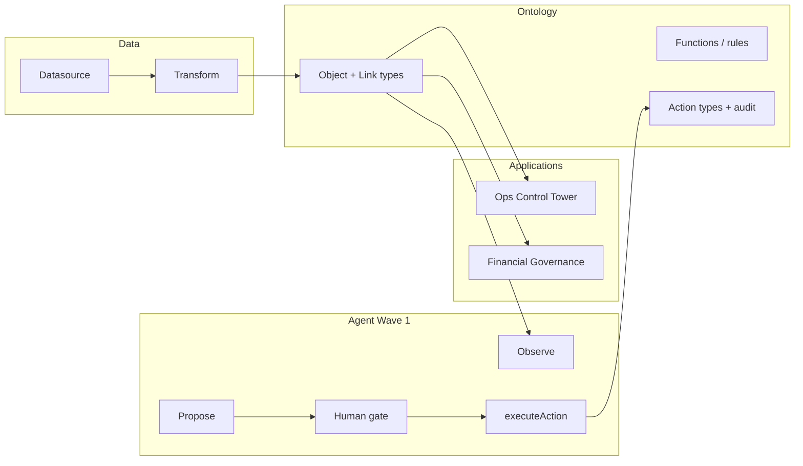

# Produk satu halaman — ontology-first + agent power user

## Satu kalimat

**Satu ontology operasional** (shipment, customer, branch, invoice, interco, …) yang dipakai semua aplikasi; **agent** hanya mengusulkan dan mengeksekusi lewat **action types** yang diaudit — bukan chatbot generik.

## Diagram arah

## MVP — 6 layar prioritas

| # | Layar | Peran |
|---|--------|--------|
| 1 | Operations Home | Command center harian |
| 2 | Shipment Monitor | Daftar & filter shipment live |
| 3 | Shipment Detail | Timeline + legs + dokumen |
| 4 | Exception Desk | Antrian exception & resolusi |
| 5 | Finance Home | KPI governance & interco |
| 6 | Interco Console | Invoice workbench lintas entity |

Detail wireframe: [`../07-derived-index/ui-spec-index.md`](../07-derived-index/ui-spec-index.md) → synthesis di `resources/`.

## Gelombang produk (Foundational Reading)

| Wave | Periode | Domain utama |
|------|---------|----------------|
| 1 | Jul–Sep 2026 | Core (18 objek) |
| 2 | Oct–Dec 2026 | Financial & Governance (7) |
| 3 | Jan–Mar 2027 | Commercial (10) |
| 4 | Apr–Jun 2027 | Network (6) |

## Agent — Wave 1

- **Suggest-only:** tidak ada write otonom tanpa persetujuan manusia.
- Loop: OBSERVE → INTERPRET (fungsi deterministik) → PROPOSE → GATE → ACT → RECORD.

Lihat EN: [`../04-product/agent-operating-loop.md`](../04-product/agent-operating-loop.md).
