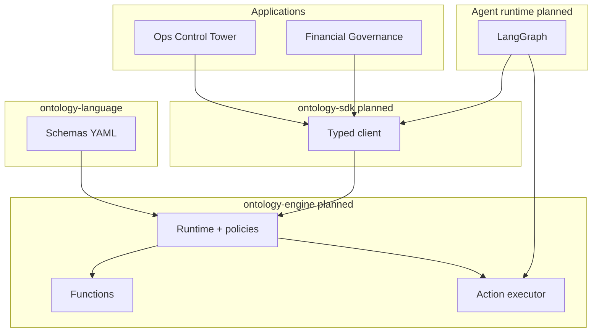

# System overview

**Status: draft** — target architecture; no `ontology-engine` implementation in repo yet.

## Package responsibilities

| Package | Responsibility |
|---------|----------------|
| `ontology-language` | Declarative types *(schemas TBD)* |
| `ontology-engine` | Validation, functions, action execution, audit |
| `ontology-sdk` | Application & agent consumer API |
| Applications | Workflow UIs |
| Agent | Propose + HITL; no shadow writes |
