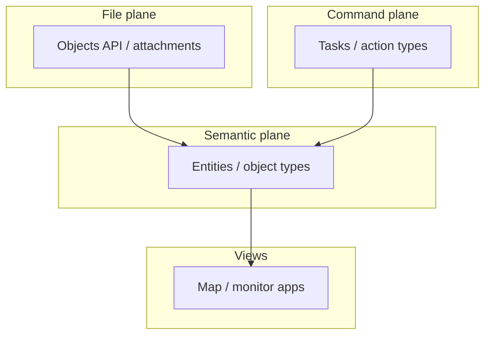

# Lattice sample apps — pattern reference

Educational map of **Lattice SDK sample applications** (operations/C2 platform) to **Daemon System Ontology** patterns. Link index only — do not mirror vendor docs or ship sample code without separate license and legal review.

**Not a dependency:** Daemon is **Palantir-inspired ontology + custom apps + LangGraph**, not Lattice SDK.

---

## Lattice primitives (vocabulary)

| Lattice term | Meaning | Daemon / Palantir analogue |
|--------------|---------|----------------------------|
| **Entity** | Real-world operational thing (vehicle, vessel, aircraft, …) with flexible attributes | **Object** (object type instance), e.g. `Shipment`, `Vehicle` |
| **Objects API** | Edge file/CDN store (upload, download, TTL, list by prefix) | **Attachments** linked to ontology objects — not semantic “object types” |
| **Task** | Request to manned/unmanned agent to act (move, sense, engage) | **Action type** + agent PROPOSE → HITL → `executeAction` |

Avoid conflating Lattice **Objects** (files) with Palantir **object types** (business entities).

---

## Sample applications

### Entity visualizer

**Purpose:** Web app showing all **entities** in an environment on a map. Starting point for the entity open data model (sensor, tactical links, operator input).

| | |
|--|--|
| **Repository** | [sample-app-entity-visualizer](https://github.com/anduril/sample-app-entity-visualizer) |
| **Daemon pattern** | Single read model for operational objects; map/monitor is a **view**, not a second system of record |
| **Daemon docs** | [mvp-screens.md](../04-product/mvp-screens.md) (Operations Home, Shipment Monitor), [dataset-vs-ontology](../01-concepts/dataset-vs-ontology.md) |

---

### Objects CLI

**Purpose:** CLI for the **Objects API** — upload with TTL, download, metadata, list with prefix filter, delete.

| | |
|--|--|
| **Repository** | [sample-app-objects](https://github.com/anduril/sample-app-objects) |
| **Daemon pattern** | Binary/document plane **beside** ontology; POD images, manifests, invoice scans |
| **Daemon docs** | Shipment Detail “Docs” tab — [ui-spec-index](../07-derived-index/ui-spec-index.md) |

---

### Integrate maritime AIS position data

**Purpose:** Ingest AIS vessel positions → model as **entity** with periodically updated location → publish to platform for other apps.

| | |
|--|--|
| **Repositories** | [AIS gRPC](https://github.com/anduril/sample-app-ais-integration-grpc) · [AIS REST](https://github.com/anduril/sample-app-ais-integration-rest) |
| **Daemon pattern** | **Datasource → transform → ontology sync** (carrier GPS, hub events, TMS) |
| **Daemon docs** | [pipeline-stages.md](../03-architecture/pipeline-stages.md) |

---

### Entity thumbnail

**Purpose:** CLI to upload images via Objects API and **link** to an entity; UI shows thumbnail on the track.

| | |
|--|--|
| **Repository** | [sample-app-thumbnail](https://github.com/anduril/sample-app-thumbnail) |
| **Daemon pattern** | File metadata + link on `Shipment` (or related type); bytes in object store |
| **Daemon docs** | [properties-shared-structs-value-types.md](../02-ontology-language/properties-shared-structs-value-types.md) (properties vs blobs) |

---

### Task an asset (auto reconnaissance)

**Purpose:** **Tasks** — requests to agents to perform activities (move, orient sensors, act on entities); basic task and status management for a notional asset.

| | |
|--|--|
| **Repository** | [sample-app-auto-reconnaissance](https://github.com/anduril/sample-app-auto-reconnaissance) |
| **Daemon pattern** | Governed **action types** with lifecycle and audit; Wave 1 agent **suggest-only** |
| **Daemon docs** | [action-types.md](../02-ontology-language/action-types.md), [agent-operating-loop.md](../04-product/agent-operating-loop.md), [ADR 002](../06-adrs/002-wave1-suggest-only-agent.md), [ADR 003](../06-adrs/003-single-execute-action.md) |

---

## Three-plane architecture (shared lesson)

| Plane | Lattice sample | Daemon |
|-------|----------------|--------|
| Semantic | Entity visualizer, AIS → entity | Ontology object types + SDK read |
| Files | Objects CLI, thumbnail | Attachment service + links on Shipment |
| Command | Task an asset | Action types + agent HITL |
| Ingest | AIS integration | Pipeline → ontology |
| Views | Map UI | Ops Control Tower MVP screens |

---

## Palantir vs Lattice vs Daemon

| Concern | Palantir Foundry | Lattice (samples) | Daemon |
|---------|------------------|-------------------|--------|
| Business thing | Object type | Entity | Object type (`ontology-language`) |
| Relationships | Link types | Entity attributes/refs | Link types |
| Change | Action types | Tasks | Action types + `executeAction` |
| Rules | Functions | App-specific | Engine functions; LLM only PROPOSE |
| Files | Varies | **Objects API** | Attachments (TBD) |
| Map UI | Workshop / Explorer | Entity visualizer | Custom (Blueprint-style) |
| Agent | AIP | Tasking assets | LangGraph + HITL |

Full Palantir portal map: [palantir-foundry-index.md](palantir-foundry-index.md).

---

## What to adopt (patterns only)

1. **One publish path** for live entity/shipment state (AIS pattern → pipeline + actions, not ad-hoc DB patches).
2. **Separate file plane** from ontology properties (Objects API pattern).
3. **Explicit task/action lifecycle** with status and audit (Task an asset pattern).
4. **Map and grids as consumers** of the same ontology read model (Entity visualizer pattern).

## What not to do without review

- Vendor sample repos as production dependencies.
- Lattice **Task** semantics copied 1:1 for finance/interco (different domain rules).
- Public repos or marketing copy naming partners unless cleared under your agreements.

---

## Related Daemon documentation

| Topic | Path |
|-------|------|
| High-level product | [product-on-a-page.md](../04-product/product-on-a-page.md) |
| UI presentation libs | [external-ui.md](external-ui.md) |
| Functions vs LLM | [functions-vs-agents.md](../02-ontology-language/functions-vs-agents.md) |
| Security / agent | [security-agent-governance.md](../03-architecture/security-agent-governance.md) |
